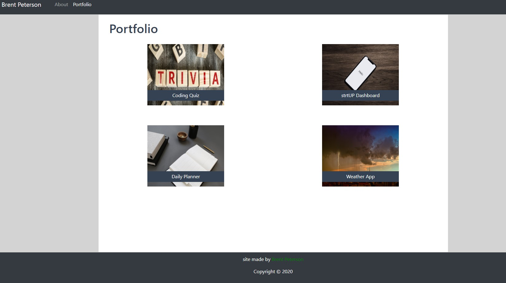

# my-portfolio

Link to application: https://brentp24.github.io/my-portfolio

Description of application: This site shows the best work I have created over the class and other relevant information.  It also includes a link to my Github profile, resume and Linkedin profile.  

